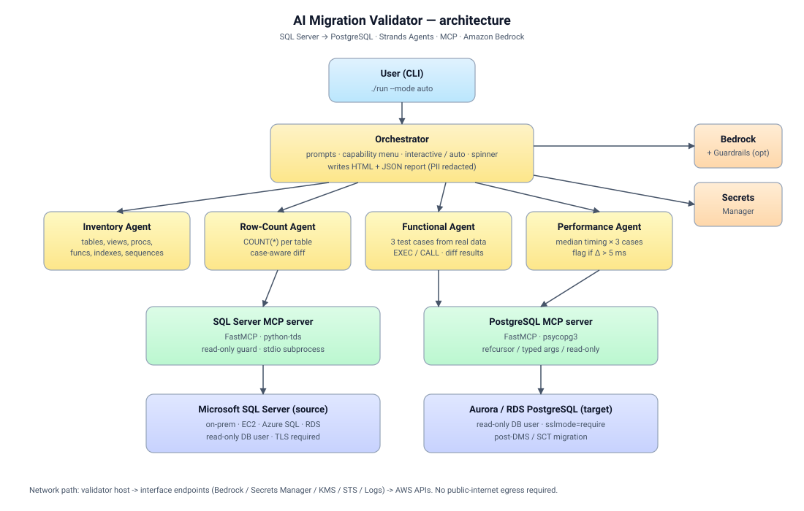

# SQL Server to PostgreSQL Migration Validator (Agentic)

[](LICENSE)
[](https://www.python.org/downloads/)
[](https://aws.amazon.com/bedrock/)

An **agentic AI system** that validates the correctness of a database migration from **Microsoft SQL Server** to **Amazon Aurora PostgreSQL / RDS PostgreSQL**. It uses [Strands Agents](https://github.com/strands-agents/sdk-python), Amazon Bedrock, and the [Model Context Protocol (MCP)](https://modelcontextprotocol.io) to drive four specialist agents through a complete post-migration validation workflow.

> This is an **AWS Sample**. It is provided as-is for educational and reference purposes. Review and adapt before using on production data.

---

## Table of Contents

- [What it does](#what-it-does)
- [Architecture](#architecture)
- [Prerequisites](#prerequisites)
- [Quick start](#quick-start)
- [What you see when you run it](#what-you-see-when-you-run-it)
- [Configuration](#configuration)
- [Output](#output)
- [Security](#security)
- [Project layout](#project-layout)
- [Contributing](#contributing)
- [License](#license)

---

## What it does

When you run the validator it walks through this exact flow:

1. **Asks for source and target details** — host, port, database, user, password, schema. Input can come from an interactive prompt, a YAML file, environment variables, or AWS Secrets Manager.
2. **Spins up MCP servers on demand** — one per unique connection (fingerprinted on host+db+user+schema). If you point two phases at the same database, the existing MCP session is reused; nothing is pre-created.
3. **Shows the four capabilities of the validator** and asks how you want to proceed: `interactive` or `auto`.
4. **Runs the four phases through MCP**, displaying results after each:

| # | Phase | What the agent does |
|---|-------|---------------------|
| 1 | **Inventory Check** | Counts every object type (tables, views, procedures, functions, triggers, indexes, sequences) in both databases. Flags missing objects in target and **extra** objects in target. |
| 2 | **Row-Count Reconciliation** | Compares row counts of every table between source and target. Flags mismatches. |
| 3 | **Functional Testing** | For each procedure/function present in both, samples real data from base tables, generates equivalent test cases for SQL Server and PostgreSQL, executes both, diffs the results, and explains any divergence. |
| 4 | **Performance Testing** | Runs each test case on source and target, captures execution time, flags any case where the target is **>5 ms slower**, and recommends tuning actions. |

5. **Generates a consolidated HTML + JSON report** in `./reports/` at the end.

Two run modes:

- **Interactive** — agent stops after each phase, prints the summary, and asks before proceeding.
- **Auto** — runs all four phases end-to-end and writes the consolidated report.

---

## Architecture



The same flow in text form:

```
                         ┌────────────────────────────────────┐
                         │          User (CLI / IDE)          │
                         └──────────────┬─────────────────────┘
                                        │  prompts for source & target
                                        ▼
                         ┌────────────────────────────────────┐
                         │       MCPSessionManager            │
                         │   (creates one MCP per unique      │
                         │    connection, reuses thereafter)  │
                         └──┬─────────────────────────┬───────┘
                            │ stdio                   │ stdio
                ┌───────────▼───────────┐   ┌─────────▼────────────┐
                │  SQL Server MCP       │   │  PostgreSQL MCP      │
                │  (FastMCP, read-only) │   │  (FastMCP, read-only)│
                └───────────┬───────────┘   └──────────┬───────────┘
                            │                          │
                            ▼                          ▼
                  ┌─────────────────┐        ┌──────────────────────┐
                  │  SQL Server     │        │  Aurora / RDS        │
                  │  (source)       │        │  PostgreSQL (target) │
                  └─────────────────┘        └──────────────────────┘
                            ▲                          ▲
                            │  MCP tool calls          │
                            │                          │
                ┌───────────┴──────────────────────────┴───────────┐
                │                Orchestrator                      │
                │   asks: interactive | auto                        │
                │   runs phases 1→4, displaying results inline      │
                └──┬─────────┬─────────┬─────────┬─────────────────┘
                   ▼         ▼         ▼         ▼
              Inventory   RowCount  Functional Performance   ─►  HTML + JSON report
                Agent      Agent     Agent      Agent
                (each agent talks ONLY through the MCP sessions above)

  Credentials: AWS Secrets Manager (preferred) | env vars | YAML | interactive prompt
  LLM:         Amazon Bedrock (Anthropic Claude family)
  Output:      HTML + JSON report (./reports/validation_<timestamp>.{html,json})
```

See [`docs/architecture.md`](docs/architecture.md) for the deeper design notes.

---

## Prerequisites

- **Python 3.11+** (Python 3.12 recommended). On macOS: `brew install python@3.12`.
- **AWS account** with Bedrock model access enabled (Anthropic Claude 3.5 Sonnet or newer recommended). See [Bedrock model access](https://docs.aws.amazon.com/bedrock/latest/userguide/model-access.html).
- **Network reachability** from your machine to both source and target databases.
- **Read-only DB credentials** for both source and target. The validator never executes DDL or DML — it only reads.

That's it. No ODBC driver, no Homebrew taps, no Docker. The SQL Server connector is pure Python.

---

## Quick start

```bash
git clone https://github.com/aws-samples/sql-to-postgres-migration-validator.git
cd sql-to-postgres-migration-validator
./run
```

The first run creates a virtual env and installs dependencies automatically. Every run after that just starts the validator. You will be prompted for source and target connection details, then asked whether to run in **interactive** or **auto** mode.

Other ways to invoke:

```bash
./run --mode auto                    # skip the mode prompt, run all four phases
./run --config config.yaml           # load saved connection details from YAML
./run --source-secret prod/source \
      --target-secret prod/target    # load credentials from AWS Secrets Manager
./run --help                         # show every flag
```

---

## What you see when you run it

```
$ ./run
--- SOURCE (sqlserver) connection ---
Host: ...
Port [1433]:
Database: ...
Username: ...
Password:
Schema [dbo]:

--- TARGET (postgresql) connection ---
Host: ...
Port [5432]:
Database: ...
Username: ...
Password:
Schema [public]:

────────────────────────  MCP setup  ────────────────────────
  + Creating MCP session [a1b2c3d4e5] for source (sqlserver host:1433/db)
    tools available: execute_select, list_objects, table_row_counts, ...
  + Creating MCP session [f6g7h8i9j0] for target (postgresql host:5432/db)
    tools available: execute_select, list_objects, table_row_counts, explain_query, ...

──────────────────  Validator capabilities  ──────────────────
 #  Phase                       What it does
 1  Inventory Check             Counts every object type ...
 2  Row-Count Reconciliation    Compares COUNT(*) for every table ...
 3  Functional Testing          Builds test cases from real data ...
 4  Performance Testing         Compares median execution time ...

How do you want to run the validator? [interactive/auto]:
```

In **interactive** mode the validator stops between phases and asks `Proceed to phase N?`. In **auto** it runs all four end-to-end. At the end:

```
HTML report: ./reports/validation_20260527T194231Z.html
JSON report: ./reports/validation_20260527T194231Z.json
```

Open the HTML in any browser, or click "Print / Save as PDF" inside it to share with the migration team.

---

## Configuration

The validator resolves connection details in this order:

1. `--config <path>` (YAML file, see `examples/config.example.yaml`)
2. AWS Secrets Manager secret IDs (`--source-secret`, `--target-secret`)
3. Environment variables (`SOURCE_HOST`, `SOURCE_PORT`, `SOURCE_DATABASE`, `SOURCE_USERNAME`, `SOURCE_PASSWORD`, and `TARGET_*` equivalents)
4. Interactive prompt (passwords masked)

Common flags:

| Flag | Default | Description |
|---|---|---|
| `--mode` | _(prompted)_ | `interactive` or `auto` |
| `--source-schema` | `dbo` | SQL Server schema to validate |
| `--target-schema` | `public` | PostgreSQL schema to validate |
| `--bedrock-model` | `us.anthropic.claude-sonnet-4-5-20250929-v1:0` | Bedrock model id (cross-region inference profile) |
| `--guardrail-id` | _(none)_ | Optional Bedrock Guardrail id for PII / topic / content filters |
| `--guardrail-version` | `DRAFT` | Guardrail version |
| `--region` | `us-east-1` | AWS region for Bedrock + Secrets Manager |
| `--report-dir` | `./reports` | Where the HTML and JSON reports are written |
| `--redact-pii` / `--no-redact-pii` | `--redact-pii` | Redact common PII patterns (email, phone, SSN, IBAN, credit card, IP, private keys) from reports |
| `--perf-threshold-ms` | `5` | Flag if target is slower by more than this |
| `--sample-size` | `100` | Rows sampled for functional test-case generation |

---

## Output

- **Console**: Rich tables for each phase. Mismatches in red, target-only objects in yellow, matches in green.
- **HTML report**: `reports/validation_<utc-timestamp>.html` — single file, self-contained, can be e-mailed or attached to a Jira ticket.
- **JSON artifact**: `reports/validation_<utc-timestamp>.json` — machine-readable.

---

## Security

- **No credentials are logged.** Connection details are redacted everywhere.
- **Secrets Manager is the recommended source.** The included CloudFormation template (`deploy/cloudformation/template.yaml`) provisions a least-privilege IAM role with read-only access to two named secrets, `bedrock:InvokeModel` and `bedrock:ApplyGuardrail` only, and a CloudWatch Logs group scoped to the project.
- **Private network path (optional, default ON in CFN).** The same template provisions a small VPC with two private subnets and PrivateLink interface endpoints for Bedrock Runtime, Secrets Manager, KMS, STS and CloudWatch Logs — so the validator never reaches AWS APIs over the public internet. Set `CreateVpc=false` if you already have a VPC and provision endpoints separately.
- **Bedrock Guardrails.** Pass `--guardrail-id <id>` and every LLM call goes through the named guardrail (PII filter, denied topics, content filters). Recommended for any run that ingests real customer data.
- **PII redaction in reports.** Procedure result rows and test-case argument values are scrubbed for emails, phone numbers, SSN, credit cards (Luhn-validated), IBANs, IPv4 and PEM private-key blocks before being written to HTML / JSON. On by default; disable with `--no-redact-pii`.
- **Read-only enforcement.** The MCP servers reject any statement that is not `SELECT`/`SHOW`/`EXPLAIN`. Procedure invocations route through a dedicated `call_procedure` tool that gates on a DML check and runs each procedure inside a `BEGIN ... ROLLBACK` for defence in depth.
- **TLS** is required for both DB connections by default (`Encrypt=yes` for SQL Server, `sslmode=require` for PostgreSQL). Override only with `--allow-insecure` (not recommended).
- **Prompt injection mitigation.** Tool outputs are summarised before being passed to the LLM, and the orchestrator never executes free-form SQL produced by the LLM without it going through the MCP tool whitelist.
- **Static + supply-chain + container scanning in CI**:
  - `ruff` (lint + format)
  - `pytest` (60+ unit tests)
  - `bandit` (Python security)
  - `pip-audit` (Python supply chain)
  - `cfn-lint --include-checks=I` and `cfn-nag` on the CloudFormation template
  - `Trivy` image + filesystem scan on the Dockerfile build (HIGH/CRITICAL fail the build); SARIF uploaded to GitHub code-scanning.

If you discover a security issue, please follow [`SECURITY.md`](SECURITY.md).

---

## Project layout

```
.
├── run                        # one-shot launcher: bootstrap + run
├── src/migration_validator/   # main package
│   ├── agents/                # one file per Strands agent
│   ├── mcp_session.py         # MCP server lifecycle (create / reuse)
│   ├── reports/               # HTML & JSON report generators
│   └── utils/                 # logging, helpers
├── mcp_servers/               # FastMCP servers (read-only)
│   ├── sqlserver_mcp/         # pure-Python (python-tds), no ODBC needed
│   └── postgres_mcp/          # psycopg3
├── deploy/
│   ├── cloudformation/        # IAM + Secrets Manager scaffolding
│   └── docker/                # Dockerfile (optional, for ECS/Fargate)
├── examples/                  # config.example.yaml
├── docs/                      # architecture.md, github-setup.md
├── tests/                     # pytest smoke tests
└── .github/                   # CI, issue & PR templates
```

---

## Contributing

See [CONTRIBUTING.md](CONTRIBUTING.md). All contributors must agree to the [AWS open-source CLA](https://github.com/aws/aws-cla).

## License

This project is licensed under the **MIT-0** license. See [LICENSE](LICENSE).
